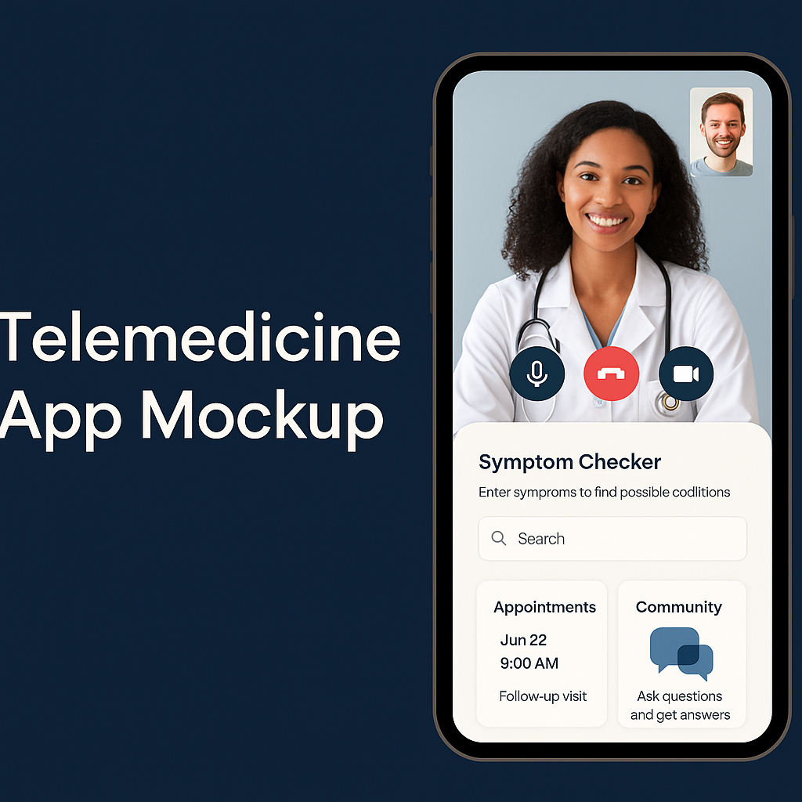

# Hi there, I'm Amanuel!👋


## About Me 🚀

I'm a passionate **Software Engineer /ProBackend developer, ProFrontend Developer/ Mobile Developer** with experience in **Python, JavaScript, Dart, ReactJS, NodeJS, Django, Numpy, Pandas, Matplotlib, React Native, MYSQL, PostgresSQL**. I love tackling complex problems, learning new skills, and collaborating with diverse teams to create innovative solutions.

- 🌱 Currently learning: **NextJS, Docker, Jenkins, Flutter**
- 🔭 Working on: **Web portfolio, Telemedicine Application**
- 🌍 Languages: **JavaScript, Python, Dart, SQL**
- 📫 How to reach me: **amanuel.bekele.asefa@gmail.com**
- ⚡ Fun fact: **I'm serious at work and help my co-worker**

## My Skills 🧠


## Featured Projects 💻

###  Telemedicine application



**Telemedicine application** is a **A telemedicine application is a digital health platform designed to facilitate remote consultations between patients and healthcare professionals. It typically consists of a frontend interface, which includes separate web or mobile portals for both patients and doctors. Patients can book appointments, initiate video calls, view prescriptions, and access medical records, while doctors can manage their schedules, conduct virtual consultations, and issue electronic prescriptions. The backend handles all business logic, data storage, user authentication, and integration with services such as payment gateways and video conferencing tools like WebRTC or Twilio.

The system stores medical records, appointment histories, and user profiles in a secure database, commonly using PostgreSQL, MySQL, or MongoDB. Security and data privacy are critical, and the application must comply with regulations such as HIPAA or GDPR. The platform is typically hosted on scalable cloud infrastructure like AWS or Google Cloud, ensuring high availability and performance.

Core features of the application include user registration, appointment scheduling, real-time video and audio consultations, in-app messaging, e-prescriptions, payment processing, and notification systems. Advanced implementations may also integrate with wearable health devices for continuous monitoring and data collection.** built with **[technologies used]**. This project demonstrates my ability to **[skills demonstrated by the project]**. You can check out the repository [here]((https://github.com/GemmechuBekele/telemedicine-application)).

### Food e-Commerce platform


**Food eCommerce platform** is a **A telemedicine application is a digital health platform designed to facilitate remote consultations between patients and healthcare professionals. It typically consists of a frontend interface, which includes separate web or mobile portals for both patients and doctors. Patients can book appointments, initiate video calls, view prescriptions, and access medical records, while doctors can manage their schedules, conduct virtual consultations, and issue electronic prescriptions. The backend handles all business logic, data storage, user authentication, and integration with services such as payment gateways and video conferencing tools like WebRTC or Twilio.

The system stores medical records, appointment histories, and user profiles in a secure database, commonly using PostgreSQL, MySQL, or MongoDB. Security and data privacy are critical, and the application must comply with regulations such as HIPAA or GDPR. The platform is typically hosted on scalable cloud infrastructure like AWS or Google Cloud, ensuring high availability and performance.

Core features of the application include user registration, appointment scheduling, real-time video and audio consultations, in-app messaging, e-prescriptions, payment processing, and notification systems. Advanced implementations may also integrate with wearable health devices for continuous monitoring and data collection.** built with **[technologies used]**. This project showcases my skills in **[skills demonstrated by the project]**. You can check out the repository [here](project_2_repository_link).


## Get in Touch 📬

- **LinkedIn**:  https://www.linkedin.com/in/gemmechubekele/
- **X**:  https://x.com/GemmechuBekele


```
